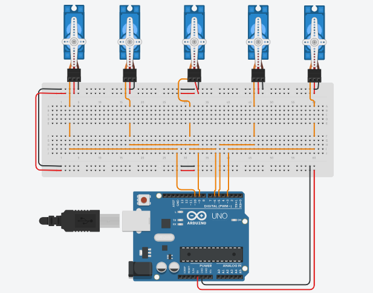

# Arduino Servo Motors Sweep Control

## Overview
This project demonstrates the control of five servo motors using an Arduino. Initially, all servos perform a sweep motion (0° to 180° and back) for 2 seconds. After completing the motion, all servos are set to hold a fixed position at 90 degrees.

The project is designed for beginners to understand servo motor control, PWM signals, and multi-motor coordination.



---

## Components
- Arduino Uno
- 5x Servo Motors
- Breadboard
- Jumper Wires

---

## Circuit Connection
Each servo motor has three wires:
- Red → 5V
- Brown/Black → GND
- Yellow/Orange → Signal

### Connections:
- Servo1 Signal → Pin 3
- Servo2 Signal → Pin 5
- Servo3 Signal → Pin 6
- Servo4 Signal → Pin 9
- Servo5 Signal → Pin 10

All servo power (VCC) connected to 5V rail  
All grounds connected to common GND (Important)

---

## Code

```cpp
#include <Servo.h>

Servo servo1, servo2, servo3, servo4, servo5;

int pos = 0;

void setup() {
  servo1.attach(3);
  servo2.attach(5);
  servo3.attach(6);
  servo4.attach(9);
  servo5.attach(10);
}

void loop() {
  unsigned long startTime = millis();

  while (millis() - startTime < 2000) {

    for (pos = 0; pos <= 180; pos += 5) {
      servo1.write(pos);
      servo2.write(pos);
      servo3.write(pos);
      servo4.write(pos);
      servo5.write(pos);
      delay(15);
    }

    for (pos = 180; pos >= 0; pos -= 5) {
      servo1.write(pos);
      servo2.write(pos);
      servo3.write(pos);
      servo4.write(pos);
      servo5.write(pos);
      delay(15);
    }
  }

  servo1.write(90);
  servo2.write(90);
  servo3.write(90);
  servo4.write(90);
  servo5.write(90);

  while (true);
}
